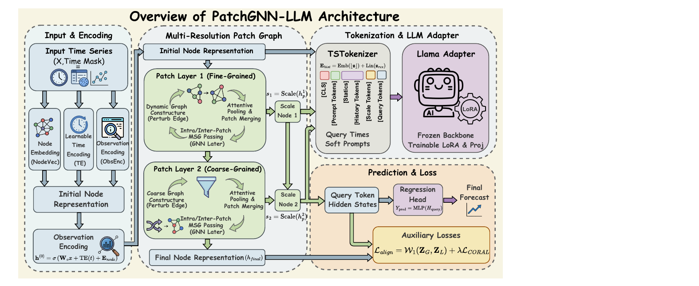

# Bridging Structure and Semantics: Graph Neural Networks as Structural Anchors for Large Language Models in Irregular Time Series Forecasting

This repository implements **PatchGNN_LLM** (the model in `model/PatchGNN_LLM.py`), our Irregular Multivariate Time Series (IMTS) forecaster that fuses graph-based patching with Large Language Models. Everything else in `model/` serves as baseline references (t-PatchGNN/Hi-Patch, TimeLLM, Qwen/Gemma/GPT variants, etc.).

> 🌟 **主角：`model/PatchGNN_LLM.py`** —— 其余模型均为 baseline，便于对比。

---

## Why PatchGNN_LLM?

1. **Multi-scale patch reasoning**  
   `Intra_Inter_Patch_Graph_Layer` builds adaptive graphs across patches/time/variables (same-time-different-variable, different-time-same-variable, etc.), powered by learnable temporal encodings.

2. **Task-aware TS tokenizer**  
   `TSTokenizer` converts per-variable embeddings, multi-scale patch nodes, historical stats, prompts, and query times into a dense token sequence with explicit `[CLS|Prompt|History|Scale|Query]` segments.

3. **Robust LlamaAdapter**  
   A custom adapter wraps `AutoModel` LLMs with LoRA, optional layer unfreezing, gradient checkpointing, and deterministic device placement, exposing a regression head back into the time-series space.

4. **Auxiliary alignment losses**  
   Patch embeddings and LLM hidden states are matched via sliced Wasserstein, CORAL, and temporal-rank consistency penalties (weights `--w1/--coral/--temp` in `run_llm.py`).

5. **Seamless fallbacks**  
   Disable `--use_llm` to fall back to the pure GNN decoder. Baselines in `model/` reuse the same dataloader & training infrastructure for apples-to-apples evaluation.

---

## Repository Layout (focus on PatchGNN_LLM)

| Path | Notes |
|------|-------|
| `model/PatchGNN_LLM.py` | **Our model**: graph patching + tokenizer + LlamaAdapter + regression head. |
| `model/PatchGNN_LLM_{Qwen, Gemma, GPT2}.py` | Variants targeting other HF backbones (same interface). |
| `model/hipatch_plus.py`, `model/tPatchGNN.py`, `model/TimeLLM.py`, `model/LLM_GNN*.py` | Baselines (Transformer-GNN hybrids, pure LLM forecasters, etc.). |
| `run_llm.py` | Training script that can import `PatchGNN_LLM` (set `from model.PatchGNN_LLM import LLM4GNN`). Provides CLI knobs for LoRA + aux losses. |
| `run_models.py` | Baseline runner (pure graph models). |
| `lib/` | Data parsers (`parse_datasets.py`, `physionet.py`, `mimic.py`, `ushcn.py`, `person_activity.py`) + evaluation utilities. |
| `layers/` | Shared blocks (Transformer enc/dec, embeddings, AutoCorrelation, etc.). |
| `scripts/` | Ready-made experiment commands (see `scripts/run_ushcn_TimeLLM.sh`, `run_physionet.sh`, `run_all.sh`). |

Install dependencies first:

```bash
pip install -r requirements.txt
```

> Torch Geometric packages must match your PyTorch/CUDA build. Refer to the official PyG installation docs if pip cannot resolve compatible wheels automatically.

---

## PatchGNN_LLM Architecture Details

1. **IMTS Encoder (`IMTS_Model`)**
   - Takes `X ∈ ℝ^{B×M×L×N}` (patch × timeline × variables) plus masks/timestamps.
   - Builds dense patch graphs via `perturb_edge_index`, with different adjacency masks for same-time/different-variable etc.
   - Applies stacked `Intra_Inter_Patch_Graph_Layer`s and scale-wise attention pooling, producing multi-resolution patch embeddings (`scale_nodes`) and final per-variable features `h_final`.

2. **Tokenizer (`TSTokenizer`)**
   - Injects prompts, discretised historical tokens, scale tokens, optional prior tokens, and future query tokens.
   - Uses bucketized statistics (mean/std/z-score discretisation via `num_buckets`) plus a learnable `[CLS]`.

3. **LlamaAdapter + Regression Head**
   - Loads any HuggingFace LLM via `AutoModel` (Llama-2/3, self-hosted path, etc.).
   - Applies LoRA (configurable ranks) and optionally unfreezes the last `n` transformer layers.
   - Projects TS embeddings to the LLM hidden size, feeds them through the adapter, then maps query token states back to scalar forecasts with `RegressionHead`.

4. **Auxiliary Losses (`forecasting(..., return_aux_losses=True)`)**
   - `sliced_wasserstein_distance`: aligns distribution of graph embeddings vs LLM query embeddings.
   - `coral_loss`: covariance alignment.
   - `temporal_rank_consistency`: smooths scale-node trajectories across patch layers.
   - Feed weights via `--w1/--coral/--temp` to `run_llm.py`; they are combined inside `_try_build_aux_losses`.

---

## Training PatchGNN_LLM

1. **Enable the model**

   ```python
   # in run_llm.py (or your custom script)
   from model.PatchGNN_LLM import LLM4GNN
   model = LLM4GNN(args).to(args.device)
   ```

2. **Example command (PhysioNet)**

   ```bash
   python run_llm.py \
     --dataset physionet \
     --history 24 --patch_size 24 --stride 24 \
     --use_llm \
     --llm_name meta-llama/Llama-2-7b-hf \
     --lora_r 8 \
     --w1 0.1 --coral 0.05 --temp 0.01 \
     --batch_size 16 --epoch 200 --gpu 0
   ```

   - Set `--use_llm` to activate the tokenizer/adapter path; omit to run the graph-only fallback.
   - LoRA/adapter precision: add `--fp16_llm` to keep the adapter in half precision.
   - For debugging, shrink dataset size with `-n 1000`; logs will be written to `logs/*debug*.log`.

3. **Scripts**
   - `scripts/run_ushcn_TimeLLM.sh`, `scripts/run_physionet.sh`, `scripts/run_all.sh` contain ready-to-run baselines. Adapt them by swapping in `PatchGNN_LLM`.

---

## Dataset Checklist

| Dataset | Loader | Notes |
|---------|--------|-------|
| PhysioNet 2012 | `lib/physionet.PhysioNet` | Set `download=True` for auto download. Data expected under `../data/physionet`. |
| MIMIC-III-Ext-tPatchGNN | `lib.mimic.MIMIC` | Place `full_dataset.csv` in `../data/mimic/raw/`. Requires PhysioNet credential. |
| USHCN | `lib.ushcn.USHCN` | Default path `/home/dragonfly/codes/t-PatchGNN/data/ushcn/`; edit `lib/parse_datasets.py` if different. Uses `USHCN_time_chunk`. |
| Person Activity | `lib.person_activity.PersonActivity` | Downloads automatically to `../data/activity`. |

All loaders emit batches with keys `observed_data`/`X`, `observed_tp`, `observed_mask`, `time_steps_to_predict`, aligning with the training scripts.

---

## Baselines Included

- **Graph-only**: `model/hipatch_plus.py`, `model/tPatchGNN.py` (original ICML 2024 models).
- **Pure LLM**: `model/TimeLLM.py`.
- **Adapter experiments**: `model/LLM_GNN*.py`, `model/PatchGNN_LLM_{Qwen,Gemma,GPT2}.py`.
- **Scripts**: `scripts/run_ushcn.sh`, `scripts/run_physionet.sh`, `scripts/run_all.sh`, etc. call these baselines directly for comparison.

Use `run_models.py` for graph baselines and `run_llm.py` (with respective imports) for LLM-enhanced baselines.

---

## Logging, Reproducibility & Tips

- Logs (CLI + file) live in `logs/`. Early stopping is controlled by `--patience`.
- `utils.setup_seed` enforces deterministic CuDNN settings; environment variable `CUDA_LAUNCH_BLOCKING=1` is set for easier debugging.
- Switch graph perturbation modes in `LLM4GNN` via `self.graph_mode`/`self.edge_keep_prob` for robustness tests.
- When loading private LLM checkpoints, set `--llm_name /path/to/model` and ensure the directory contains HF config/weights.

---

## Citation

```bibtex
@inproceedings{zhangirregular2024,
  title={Irregular Multivariate Time Series Forecasting: A Transformable Patching Graph Neural Networks Approach},
  author={Zhang, Weijia and Yin, Chenlong and Liu, Hao and Zhou, Xiaofang and Xiong, Hui},
  booktitle={Forty-first International Conference on Machine Learning},
  year={2024}
}
```

---

## 中文速览（PatchGNN_LLM）

- 主模型：`model/PatchGNN_LLM.py`（Graph Patch → Tokenizer → LlamaAdapter → Regression Head）；其余 `model/*` 仅作 baseline。  
- 运行 `run_llm.py` 前，将导入改为 `from model.PatchGNN_LLM import LLM4GNN`，并使用 `--use_llm --llm_name <你的LLM路径>`。  
- LoRA 参数：`--lora_r`, `--w1/--coral/--temp` 控制对齐损失；关闭 `--use_llm` 即回退到纯 GNN 解码。  
- 数据放在 `../data/{physionet,mimic,activity,ushcn}`，确保与 `lib/parse_datasets.py` 中的路径一致。  
- 参考 `scripts/run_ushcn_TimeLLM.sh`、`scripts/run_physionet.sh`（baseline 命令）即可快速对比我们的 PatchGNN_LLM。
